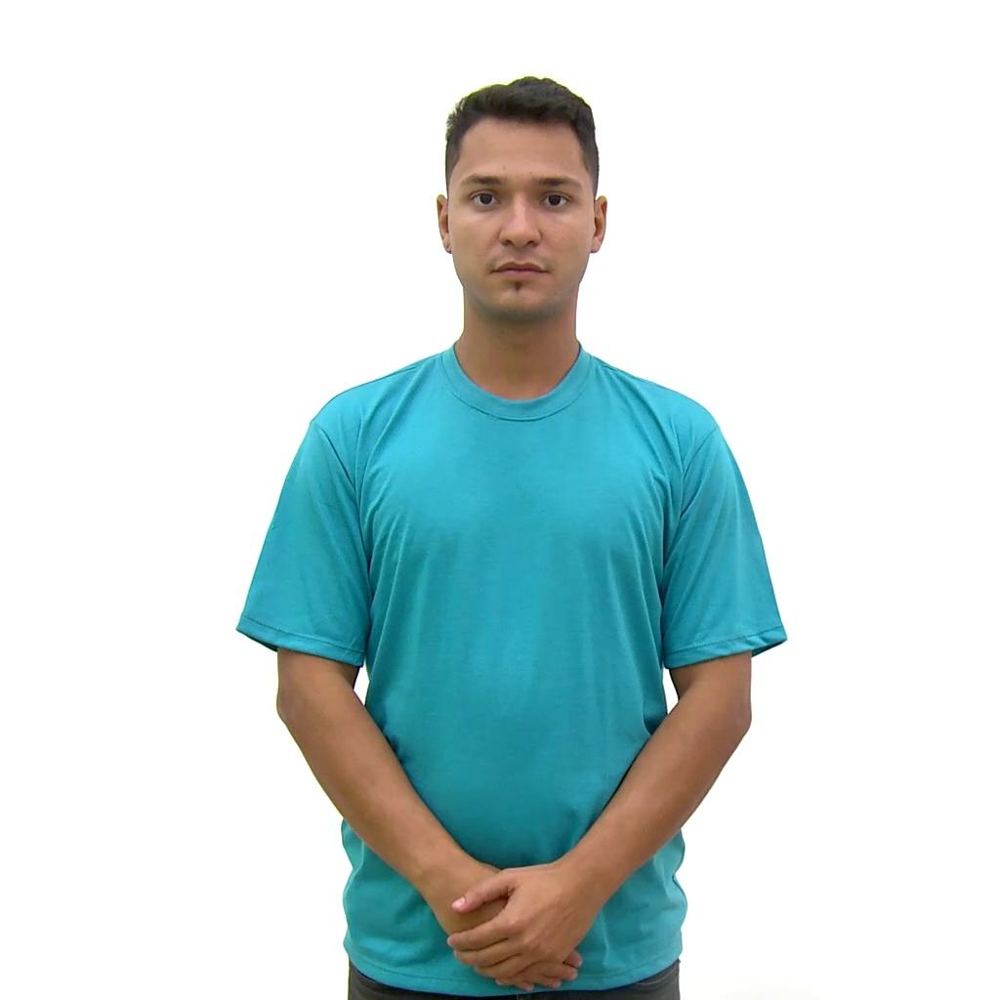
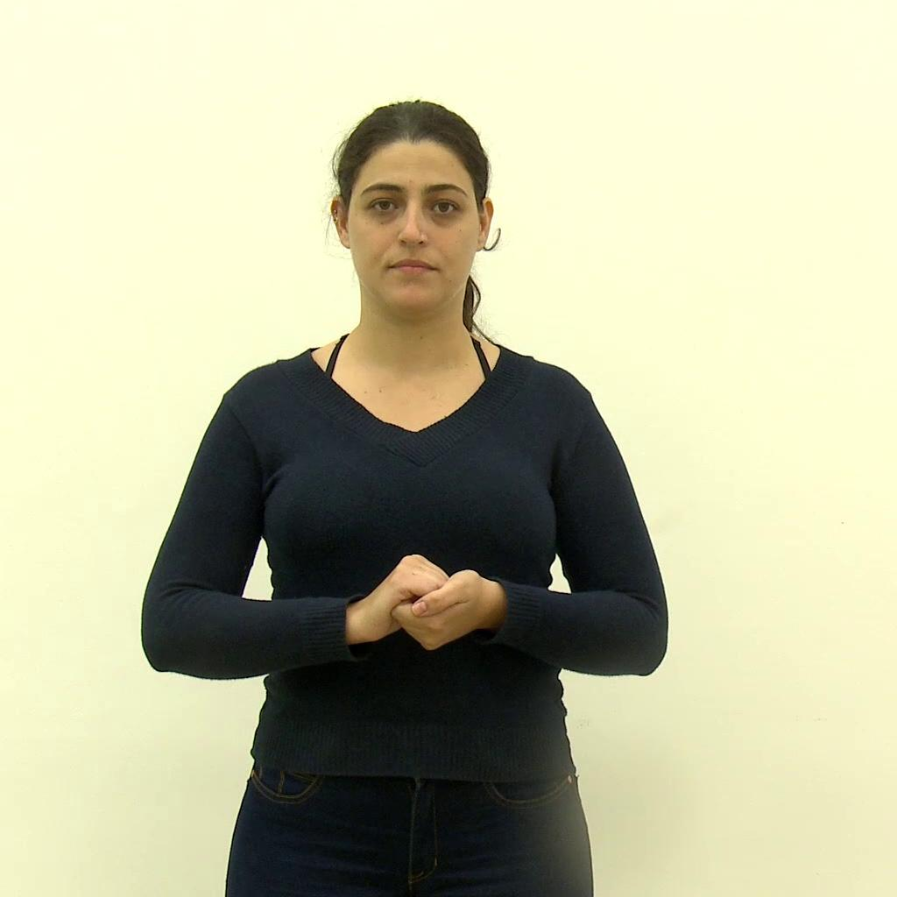
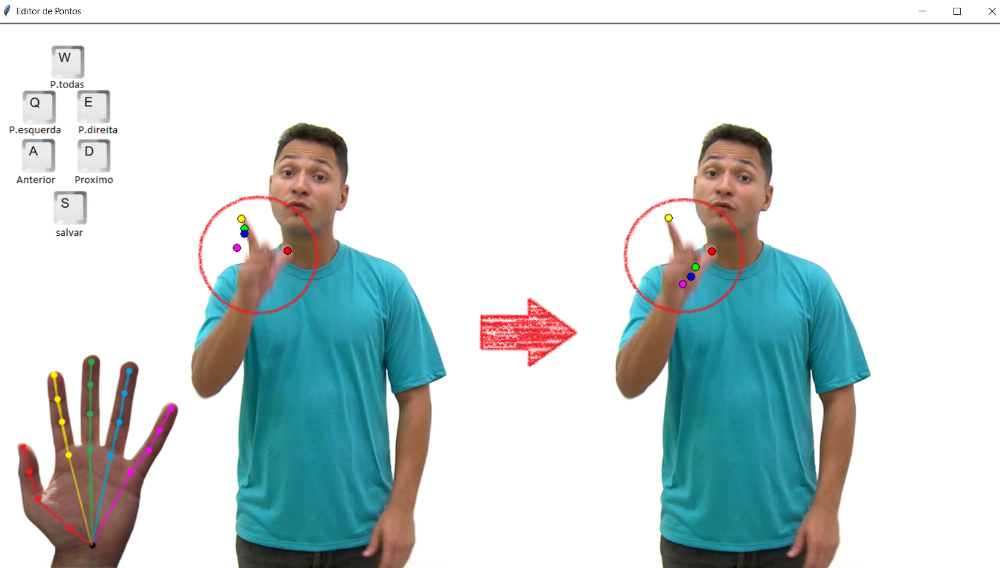

# SynLibras-Pose dataset

The SynLibras-Pose is a dataset of videos of Brazilian Sign Language (Libras) signers speaking single words and annotated with their body poses. The dataset was introduced by Andrew Allaniz, Wellington Silveira, Marina Hurtado, Bernardo Castello, and Rodrigo de Bem, from the Center of Computational Sciences (C3), at the Federal University of Rio Grande (FURG). 

To cite the dataset use the BibTeX entry below:
```
@inproceedings{silveira2022synlibras,
  title={SynLibras: A Disentangled Deep Generative Model for Brazilian Sign Language Synthesis},
  author={Silveira, Wellington and Alaniz, Andrew and Hurtado, Marina and da Silva, Bernardo Castello and de Bem, Rodrigo},
  booktitle={2022 35th SIBGRAPI Conference on Graphics, Patterns and Images (SIBGRAPI)},
  volume={1},
  pages={210--215},
  year={2022},
}
```

## Overview

The database was collected from the videos of the Libras-Portuguese dictionary project (Federal University of Viçosa, 2017). Using image manipulation in the Python language, the frame-by-frame videos and these were resized to 1024x1024 pixels.




## Dataset

The dataset is available for download [here](https://mega.nz/file/JFZmkJQR#DGAgMi1NVBWaD72aTJGh9EQrXAWFAZCe9wrDlm7mIZQ).

The 427 videos were obtained containing more than 73,000 frames numbered by actors. Each video represents a word or a concept. We divided the videos by the 4 actors remaining after pre-processing. The data is composed of videos, frames, and poses, with each video having its frames and poses associated with their respective names.
The generated poses consisted of 12 body points, 10 points for the hands, and 8 facial points.


With high-definition images, the loss of keypoints if mitigated for each frame, achieving in general higher accuracy than other datasets with low-resolution images. Despite this, there may still be inconsistencies in the estimation of poses that can harm the training of methods based on these data. Thus, one of the contributions of this work was the development of a tool for viewing and editing component points of the body pose. Therefore, it was possible to correct errors in the active giving greater precision and accuracy to the pose estimates.


With this tool, it is possible to identify keypoints in the JSON metadata file and edit them to maintain a higher precision standard than just using the [OpenPose](https://github.com/CMU-Perceptual-Computing-Lab/openpose) estimator.




