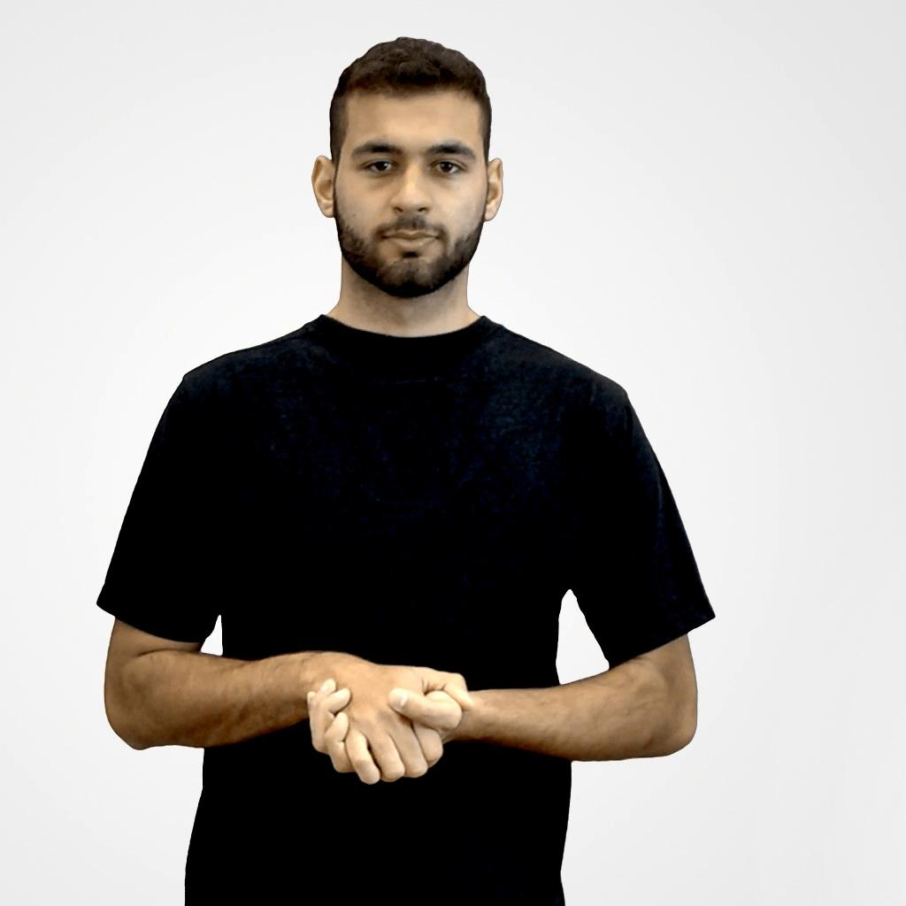

# Data-Base
SynLibras: A database with body posture notation Model for Brazilian Sign Language Synthesis.
Wellington Silveira (FURG); Andrew Allaniz (FURG); Marina Hurtado (FURG); Bernardo Castello (FURG); 
Rodrigo de Bem (FURG).
SIBGRAPI 2022.

## Overview

The database was collected from the videos of the Libras-Portuguese dictionary project (Uni-Federal University of Viçosa, 2017).Using image manipulation in the Python language, theframe-by-frame videos, and these were resized to 1024x1024 pixels.

## Dataset
 
the bank is available at this link

(https://mega.nz/file/JFZmkJQR#DGAgMi1NVBWaD72aTJGh9EQrXAWFAZCe9wrDlm7mIZQ)
427 videos were obtained containing more than 73,000 frames numbered by actors. Each video represents a word or a concept of it, we divided the videos by their 4 actors remaining after pre-processing. split up still the data in videos, frames and poses, with each video having its frames and poses associated with their respective names.

[OpenPose](https://github.com/CMU-Perceptual-Computing-Lab/openpose)

